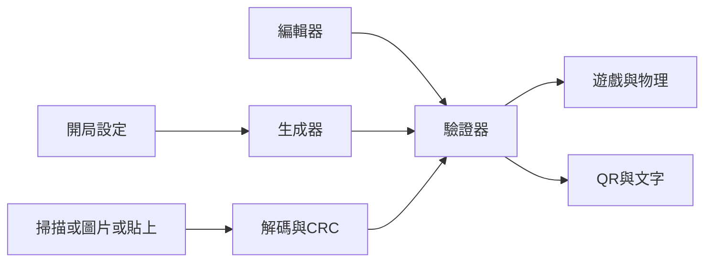

# 便便滾滾

離線 Android app，套件 `my.playground.maze`。地圖就是資料，不經伺服器。玩家傾斜手機，讓便便滾過迷宮，繞過障礙，到達出口。

App 圖示是便便。

可安裝的 APK 由 GitHub Actions 組建。推上 `v*` tag（例如 `v1.0`）後，Actions 用 debug keystore 簽名，並把 `maze-v1.0.apk` 掛到 GitHub Release。


# 功能

- 自動生成迷宮：DFS、Kruskal、Prim
- 自訂難度，或自選寬、高、河流數
- 傾斜控制；沒有感應器時可以用手指拖曳
- 編輯器畫地圖。驗證通過才能試玩或分享
- 分享 QR，或複製成文字
- 加入地圖：鏡頭掃描、從圖片讀 QR、貼上文字
- 主題：石牆、素描、像素。只影響畫面，不寫進地圖。生成之後仍可改
- 遊戲計時。過關可以再玩同一張、開同難度新地圖，或升級難度
- 提示：由便便現在的位置畫到出口

# 地圖

- 寬 4–20 格，高 4–40 格
- 外框永遠是牆

# 配件

- 便便 — 局內角色，不佔格子，不寫入地圖。開局在入口格中心。由幾個圓組成，小於一格
- 道路 — 可以通過的格子
- 障礙物 — 格子邊上的牆。碰到會反彈並減速
- 入口 — 開始所在的格子，全圖一個
- 出口 — 便便中心進入此格即過關。遊戲中這一格顯示「出」
- 河流 — 便便中心進入此格即落水：速度清零，送回入口

每個格子 1 byte。高 3 bit 是類型，bit 4 保留為 0，低 4 bit 是牆，順序上右下左。`1` 不可通過，`0` 可通過。

| 類型 | 含義 |
| --- | --- |
| `000` | 道路 |
| `001` | 入口 |
| `010` | 出口 |
| `100` | 河流 |
| `011` `101` `110` `111` | 保留，驗證拒絕 |

相鄰的邊，任一方為 `1` 即不可通過。靠外框的一邊即使 bit 是 `0` 也不能走出地圖。入口與出口至少要有一邊真正走得出去。

示例：

```
001 0111  入口，只有上方可通過
010 1011  出口，只有右方可通過
100 0000  河流，四面內部可通過
000 0001  道路，左邊不可通過
```

# 生成

三種都先刻完美迷宮，入口放在左上角 `(0,0)`，出口放在離入口最遠的格子。河流只放在不在最短路上的格子。自動生成的河流清走內部障礙；靠地圖外框的牆保留。

- DFS：遞迴回溯
- Kruskal：岔路較均勻
- Prim：死路較多

難度：

- 易：8×6，0 條河，拆少量牆變成環路
- 普通：12×10，4 條河，完美迷宮
- 難：16×16，10 條河，完美迷宮
- 自訂：寬 4–20、高 4–40、河流 0–40

過關後：

- 再玩一次：同一張圖，計時歸零
- 同難度新地圖：同一演算法與尺寸，重新生成
- 升級難度：易到普通，普通到難。難或自訂則寬 +2（上限 20）、高 +2（上限 40）、河流 +2（上限 40）

編輯或掃描進來的地圖沒有這兩個生成按鈕。

# 驗證

遊玩或分享前用 BFS 檢查。失敗時用中文指出原因。

- 寬高在範圍內
- 恰好一個入口、一個出口
- 類型與保留位合法
- 入口與出口各自至少有一邊真正可通過
- 由入口走到出口，不進入河流
- 外框封閉

# 局內

- 優先用遊戲旋轉向量，否則旋轉向量，否則加速度計
- 固定時間步進。撞得夠力會反彈並減慢；輕輕擦過只取消朝牆的速度
- 沒有感應器，或想手動時，可以拖曳畫面推動便便
- 計時在遊玩時累積。暫停、設定、分享時停住。過關停在所用時間
- 開局底部先顯示玩法說明，2 秒後換成地圖大小與 `分:秒`
- 提示按鈕畫出由便便當前格子到出口的淺色路徑。這局開過提示，分享成績會註明
- 過關畫面顯示時間，並可再玩、開新圖、升級、分享、返回

# 編輯器

像填色一樣塗地圖。

- 上方設定寬與高。點一下加一或減一，長按連續加減。按建立後顯示空白格子
- 空白內部是道路。建立時自動封外框。驗證、試玩、分享前會再封一次
- 單指塗色。雙指縮放與移動
- 下方工具：道路、入口、出口、河流、障礙物
- 道路、入口、出口、河流改格子類型。新的入口或出口會把舊的改回道路
- 障礙物點格子的某一邊，切換該邊是否可通過

# 主題

設定裡可改，並套到首頁、開局、編輯器外框與對話框。

- 石牆、像素：深底淺字
- 素描：淺底深字

迷宮格子與遊戲畫面維持原樣。遊戲上方工具列保持深色。

# 分享與加入

通過驗證後才可分享。QR 內容是二進位，以 ISO-8859-1 寫入：

`MZ` + 版本 `1` + 寬 + 高 + 每格 1 byte + CRC16

20×40 約 800 byte。

分享對話框標題是「分享 N×N 迷宮」。若已過關，顯示「我用了 1分 05 秒 通過了這關」；這局開過提示則尾加「（開了hints）」。QR 下面寫「截圖分享 | APP內掃描加入迷宮」。複製文字得到上述 byte 的 Base64，本身不含空格或換行。

加入方式：

- 鏡頭掃描 QR
- 從圖片讀 QR
- 首頁貼上 Base64。先去掉空格、換行與前後空白，再解碼

三種都先驗 CRC，再跑驗證器。失敗顯示原因，不進入遊戲。


